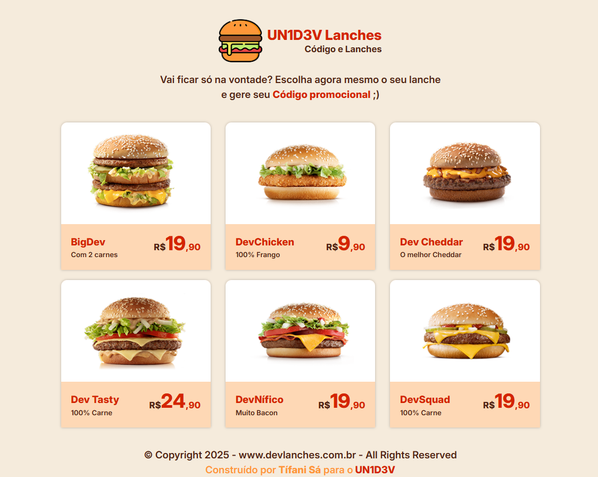

# 🍔 Un1d3v Lanches

Un1d3v Lanches é um layout responsivo e moderno desenvolvido utilizando **HTML, CSS e SASS**. 
O projeto foi criado com o objetivo de proporcionar uma interface visual atrativa para um site de lanchonete, 
destacando seus produtos e promovendo uma experiência de navegação intuitiva para os usuários. 🚀

## 🛠 Tecnologias Utilizadas

- **📌 HTML**: Estrutura do site.
- **🎨 CSS**: Estilização e responsividade.
- **🌀 SASS**: Organização e otimização do CSS com variáveis, mixins e modularização.

## 🌟 Funcionalidades

- ✅ Layout responsivo para diferentes dispositivos.
- 🎯 Design moderno e atraente.
- 🔧 Uso de variáveis e mixins do SASS para melhor manutenção do código.
- 📂 Organização modular dos estilos para facilitar futuras modificações.

